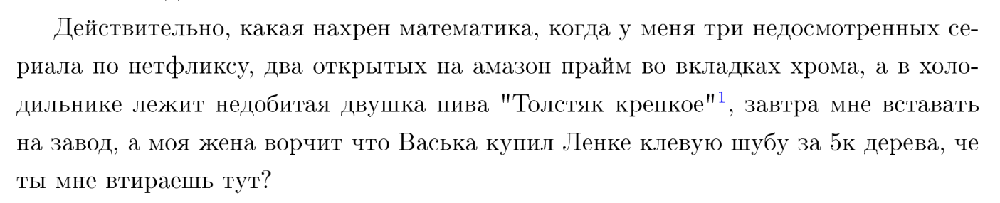

# Нужна ли математика?

Часто можно заметить поднимающийся риторический вопрос от некоторых людей: "А нужна ли математика?"

Ну что ж, давайте разберемся вместе

PDF: [тык](https://kolosovpetro.github.io/pdf/MathIsNecessary.pdf)

# In the next episode

- 
- 

# Acknowledgements

Inspired by [Ketteiteki](https://github.com/Ketteiteki)